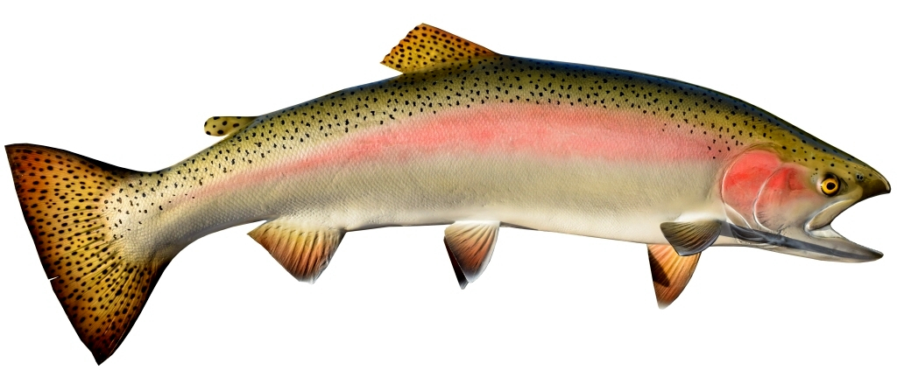

```{r setup, include=FALSE}
knitr::opts_chunk$set(echo = TRUE,
                      warning = FALSE,
                      message = FALSE)

# For general stuff:
library(tidyverse)
library(janitor)
library(lubridate)
library(here)
library(paletteer)

# For ts stuff: 
library(tsibble)
library(fable)
library(fabletools)
library(feasts)


steelhead <- read_csv("steelhead_tidy.csv") %>% 
  clean_names()
```

##Task 2: Time series data wrangling, exploration and visualization

**For Task 2 you will wrangle, explore, and visualize time series data for steelhead salmon passage across the Bonneville Dam (Oregon) from 1940 - 2019.** 

Data from: Columbia Basin Research Available here: Adult fish passage (http://www.cbr.washington.edu/dart/query/adult_graph_text)
Citation: Columbia River DART, Columbia Basin Research, University of Washington. (2019). Adult Passage Graphics & Text. Available from http://www.cbr.washington.edu/dart/query/adult_graph_text
Data: download steelhead passage data HERE

**You get to decide how you want to explore and visualize this time series data. Here’s what you should prepare:**
- A single polished HTML (knitted from .Rmd), planning that this might be a post/project you’d include on your personal blogdown site, that includes at least:

*[Image(s), with captions and necessary citation(s), of Bonneville Dam and/or steelhead (or whatever time series data you choose to explore]*

 


##Introduction 
**A useful descriptive introductory summary (3 - 4 sentences) of what’s contained in the project**


##Analysis
**All of your organized and well-annotated code (with warnings/messages hidden) used to create at least:**

###Data Cleaning and Wrangling
Plan: change the date, parse out 
Question: why are there negative values?

```{r}

#check out some of the columns - are they all necessary?

unique(steelhead$datatype) #only one data type

min(steelhead$year)

#first want to separate out the dates and parse data
steelhead_clean <- steelhead %>%
  mutate(
    date = paste(year, mm_dd, sep = "-")
    ) %>% 
  mutate(
    yr_mo_day = lubridate::parse_date_time(date, "ydm"),
    yr_mo_day = as.Date(yr_mo_day), #since ours started out as characters
    month_sep = yearmonth(yr_mo_day)
  ) %>% 
  mutate(
    month = month(yr_mo_day, label = TRUE)
  ) %>% 
  select(-mm_dd, -datatype, -location, -parameter) %>% 
  drop_na(month_sep, value)
#check_NAs

#steelhead_dates_final <- steelhead_dates[,c(4,5,1,3,2)]


```


###Time Series Plot
- A finalized time series plot of the original observations (daily data)
```{r}
#daily data is challenging - plot the whole yr_mo_day

steelhead_daily <- ggplot(steelhead_clean, aes(x = yr_mo_day, y = value))+
  geom_line(color = "seagreen") + 
  theme_minimal()

steelhead_daily

```


###Seasonplot
- A finalized seasonplot to explore if/how monthly passage has shifted over time (I totaled counts by month before doing this...you can choose if you want to do that
```{r}
#group by month
steelhead_by_month <- steelhead_clean %>%
  group_by(month, year) %>% 
  summarize(
    month_tot = sum(value)
  ) 

#steelhead_ts_agg %>% gg_subseries(month_tot) #need to aggregate by month, this didn't work

steelhead_ts %>% gg_season(value)

# What if gg_season() didn't work? Well we can make this with ggplot anyway!
# Remember our other parsed version (renew parsed):
# 
steelhead_seasonplot <- ggplot(data = steelhead_by_month , aes(x = month, y = month_tot, group = year)) +
   geom_line(aes(color = year))+
  theme_minimal()+
  scale_y_continuous(expand = c(0,0), breaks = seq(0, 400000, by = 50000), labels = scales::comma)+
  guides(color = guide_legend(title = "Year"))+
  labs(x = "Month", y = "Total fish passage")


steelhead_seasonplot +
  scale_color_paletteer_c("pals::ocean.deep")

#to do:
#fix colors
#
```

###Annual Steelhead passage
- A finalized visualization of annual steelhead passage counts 
```{r}
#group by year
steelhead_by_year <- steelhead_clean %>%
  group_by(year) %>% 
  summarize(
    yearly_tot = sum(value)
  ) 


steelhead_yearly <- ggplot(steelhead_by_year, aes(x = year, y = yearly_tot))+
  geom_line(color = "salmon")+
  scale_y_continuous(expand = c(0,0), breaks = seq(0, 600000, by = 100000), labels = scales::comma)+
  theme_minimal()

steelhead_yearly

```


Make sure that your figures appear in your final knitted document, each with a useful caption. Include text associated with each to help the audience understand and interpret the results. 
